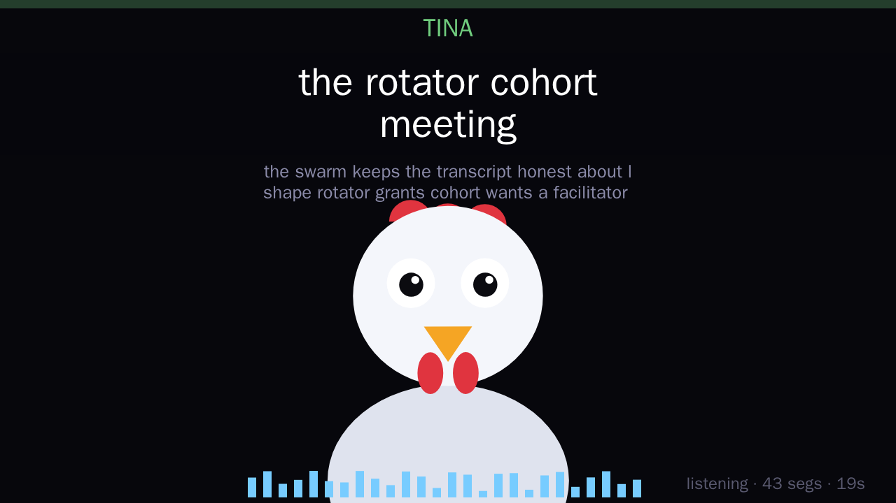
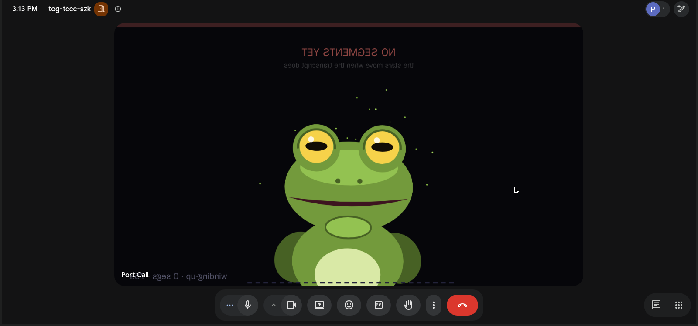

# Port Call

A proof of concept that turns [Vexa](https://github.com/Vexa-ai/vexa) from a *transcription* bot
into a bot that **acts in the meeting**: it speaks, posts and reads chat, sends emoji reactions,
publishes a live video feed it draws itself, and shares a screen.

All of it is driven by one `redis PUBLISH`.

<p align="center">
  
  
</p>

<p align="center"><em>Left: the camera the bot draws. Right: Google Meet accepting it as a webcam — the tile text is mirrored because Meet mirrors self-view, so this really went through <code>getUserMedia</code>. The status line <code>listening · 43 segs · 19s</code> is <strong>derived</strong>, not commanded: it follows transcript recency, so the face cannot claim the pipeline is healthy when it isn't.</em></p>

You drive it by publishing one JSON command to the meeting's bus:

```bash
redis-cli PUBLISH bot_commands:meeting:42 '{"action":"speak","text":"On it — sharing my screen now."}'
# the bot says it aloud in the call, in its own voice

redis-cli PUBLISH bot_commands:meeting:42 '{"action":"reaction","emoji":"🎉"}'
# a 🎉 lands in the meeting
```

[Source on GitHub](https://github.com/amiller/vexa-poc) ·
[Issues](https://github.com/amiller/vexa-poc/issues)

## What works

| Surface | How | Verified |
|---|---|---|
| Join | Vexa's join layer, headless Chromium | ✅ real Meet |
| Transcribe | Vexa pipeline → Whisper (against a **TEE** endpoint) | ✅ speaker-attributed |
| Speak | TTS shim → PulseAudio null sink → the bot's mic | ✅ |
| Sound effects | `!airhorn` in the speak text returns a wav instead of speech | ✅ |
| Chat send / read | Meet's chat panel, driven by Playwright | ✅ |
| Emoji reactions | Meet's reaction picker | ✅ |
| Camera | canvas → `getUserMedia` patch → a live HUD + animated avatar | ✅ |
| Screenshare | the same canvas → `getDisplayMedia` patch | ✅ |

## Architecture

<p align="center">
<svg viewBox="0 0 880 340" width="100%" style="max-width:820px;font-family:ui-monospace,SFMono-Regular,Menlo,Consolas,monospace" role="img" aria-label="redis acts.v1 drives one bot process holding a Playwright page into Google Meet; Whisper on a TEE endpoint returns transcripts on redis transcript.v1.">
  <defs>
    <marker id="ah" markerWidth="9" markerHeight="9" refX="7" refY="3" orient="auto"><path d="M0,0 L7,3 L0,6 Z" fill="#57606a"/></marker>
  </defs>
  <!-- acts.v1 in -->
  <rect x="8" y="44" width="150" height="56" rx="8" fill="#ddf4ff" stroke="#0969da"/>
  <text x="83" y="68" text-anchor="middle" font-size="13" fill="#0969da">redis</text>
  <text x="83" y="87" text-anchor="middle" font-size="13" font-weight="bold" fill="#0969da">acts.v1</text>
  <line x1="158" y1="72" x2="252" y2="72" stroke="#57606a" stroke-width="1.5" marker-end="url(#ah)"/>
  <!-- bot process -->
  <rect x="256" y="24" width="336" height="150" rx="8" fill="#f6f8fa" stroke="#24292f"/>
  <text x="424" y="48" text-anchor="middle" font-size="13" font-weight="bold" fill="#24292f">bot process (Node/TS, one per meeting)</text>
  <text x="424" y="76" text-anchor="middle" font-size="12" fill="#57606a">holds one Playwright Page → one Chromium</text>
  <text x="276" y="104" font-size="11.5" fill="#24292f">speak → PulseAudio null sink → virtual mic</text>
  <text x="276" y="126" font-size="11.5" fill="#24292f">camera / share → canvas → patched getUserMedia</text>
  <text x="276" y="148" font-size="11.5" fill="#24292f">chat / reactions → Meet DOM</text>
  <line x1="592" y1="72" x2="686" y2="72" stroke="#57606a" stroke-width="1.5" marker-end="url(#ah)"/>
  <!-- Meet -->
  <rect x="690" y="44" width="150" height="56" rx="8" fill="#f6f8fa" stroke="#24292f"/>
  <text x="765" y="78" text-anchor="middle" font-size="13" font-weight="bold" fill="#24292f">Google Meet</text>
  <!-- transcript path back -->
  <path d="M765,100 L765,256 L602,256" fill="none" stroke="#57606a" stroke-width="1.5" marker-end="url(#ah)"/>
  <rect x="430" y="228" width="170" height="56" rx="8" fill="#f6f8fa" stroke="#24292f"/>
  <text x="515" y="252" text-anchor="middle" font-size="12.5" fill="#24292f">Whisper</text>
  <text x="515" y="271" text-anchor="middle" font-size="11.5" fill="#57606a">TEE endpoint</text>
  <line x1="430" y1="256" x2="336" y2="256" stroke="#57606a" stroke-width="1.5" marker-end="url(#ah)"/>
  <rect x="160" y="228" width="170" height="56" rx="8" fill="#ddf4ff" stroke="#0969da"/>
  <text x="245" y="252" text-anchor="middle" font-size="13" fill="#0969da">redis</text>
  <text x="245" y="271" text-anchor="middle" font-size="13" font-weight="bold" fill="#0969da">transcript.v1</text>
</svg>
</p>

The bot process owns join + capture + speak + chat + camera + share for exactly one reason: it
holds the **Playwright `Page` handle**, a live pipe to one Chromium. Anything touching that DOM
must run in that process. Nothing else is coupled — **acts in / transcripts out, both over redis**
— so the brain can live anywhere, in any language.

## The Signal lane

A second lane puts the same bot in a **Signal** call instead of Google Meet — proof that the act
vocabulary is not Meet-specific. Two containerised Signal Desktops, driven over CDP, join a call
link, speak, and transcribe; `signal-lane/e2e.sh` proves it with no human in the room (seat A
speaks, seat B listens — 12 checks, ~3 min). Confirmed in a live call on 2026-08-30.

It is shaped differently because Signal's media never enters JavaScript. RingRTC is a native module
that opens PulseAudio itself and captures the camera from a **device**, so patching `getUserMedia`
in the renderer fools only Signal's own UI — the far end still sees the account avatar. Every media
direction is therefore a virtual device: the HUD becomes a real `v4l2loopback` camera
(`hud.js → chromium → ffmpeg x11grab → v4l2loopback → RingRTC`), and audio takes the same
PulseAudio graph the Meet rig already uses.

The lane is built and green. It establishes audio, control, and join; speaker attribution is
untested because both seats are linked devices of one account. See
[`signal-lane/`](https://github.com/amiller/vexa-poc/tree/main/signal-lane) for the full account.

## The documents

- **[Findings](findings.md)** — the measurements that cost the most time. Why the obvious approach
  silently does nothing, per surface. Start here if you are building something similar.
- **[Roadmap](roadmap.md)** — what this is trying to become and what stands in the way.
- **[How it gets maintained](swarm.md)** — most of this was written by agents; this is the
  constraint that makes that work, and the honest account of what is *not* automated.
- **[Where it runs](operations.md)** — hosts, the CVM question, and what it would take to run this
  yourself.
- **[Development](dev.md)** — the hot-swap loop, the `patches/` ↔ `live/` discipline, the test
  ladder.
- **[Credentials](credentials.md)** — four tiers, what each unlocks, and what can never ship.

The test ladder, for orientation:

```
./e2e.sh                        # 10 checks against a real meeting, unattended, ~90s
./bench.sh                      # 8 checks with no meeting, no bot, no human, ~40s
./hotswap.sh                    # ~3s: edit TypeScript, next act runs it, bot keeps its seat
./demo.sh join                  # a long-lived bot you iterate against
```

## License

Contains modified files from [Vexa](https://github.com/Vexa-ai/vexa) (Apache-2.0); the
modifications live in `patches/` under the same license, and `NOTICE` records what changed. The
harness, shims, and documentation are original work under Apache-2.0.

This is a **proof of concept**, not a product. It automates a Google Meet UI that Google does not
offer an API for; expect it to break when that UI changes, and don't deploy a bot into anyone's
meeting without their knowledge.
